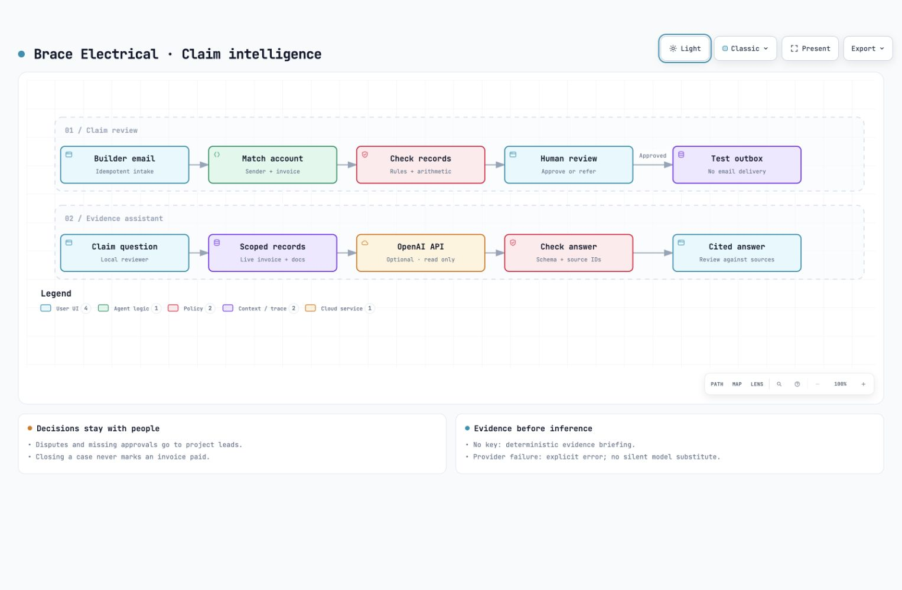

# Brace Electrical
## Less time chasing paperwork. A clearer path to payment.

I built Brace to help electrical contractors resolve the paperwork that holds up payment after the work is done.

When a builder questions an invoice, your accounts team needs more than a reminder to follow up. They need the right purchase order, a signed labour docket, an approved variation and a clear understanding of what still needs checking. Brace brings those records into one job file and helps your team prepare the next response.

**My proposal: give accounts and site teams one place to turn a builder query into an evidence-backed decision.**


## What this would do for your business

| When your team faces… | Brace helps them… |
| --- | --- |
| A builder asking for a missing PO | Locate the matching record and prepare a reply for approval |
| Labour hours disputed against a signed docket | See the difference in hours and value, with the source beside it |
| A variation without price approval | Identify the missing approval and refer the issue to the project lead |
| A payment claimed but not confirmed | Route the query to finance without assuming the invoice is paid |
| A difficult handover between accounts and site | Explain the evidence, open questions and next step in one claim file |

The intended benefit is less time reconstructing the job history and fewer replies based on incomplete records. A pilot would measure those outcomes against your current process; I am not claiming proven savings or recovered revenue.

## How the workflow works



[Open the interactive Archify workflow](docs/diagrams/claim-workflow.html). Download the HTML and open it in your browser, or select **Workspace guide → Explore the interactive workflow** while running the app.

1. **Capture the builder’s query.** Save the correspondence and prevent duplicate intake events.
2. **Find the right claim.** Match the sender and invoice, then retrieve the associated records.
3. **Check the evidence.** Verify arithmetic and surface missing or conflicting documents.
4. **Prepare the next step.** Review a grounded reply or ask the evidence assistant for an explanation.
5. **Keep the decision with your team.** Approve a reply, refer a question to site or finance, and retain the decision history.

The assistant can explain a discrepancy, identify missing evidence and prepare a project-manager handover. Its answers include source links for review. It cannot approve a claim, update the ledger or send a message.

## See it with a realistic claim

Open **Woolloongabba Medical / INV-1043**. The invoice bills **42 hours**, while the signed docket approves **36 hours**. At AUD 150 per hour, Brace shows a **six-hour / AUD 900 difference** and keeps the reply blocked for review.

Open the signed docket, use **Ask the file**, and add a note for the project manager. The evidence and referral remain together in the claim history.

Then open **Newstead Exchange / INV-1042**. A matching PO is available, so you can review the draft and approve it into the local outbox. **Approved replies are saved locally; no external email is sent.**

The demonstration includes six builder queries across five jobs, covering purchase orders, invoice copies, labour disputes, variations and payment reconciliation.

## Try the demonstration

**Python 3.10+ is the only requirement.** No package installation, database server or API key is needed for the offline demonstration.

```sh
git clone https://github.com/TanmaySomani/Brace-Electrical.git
cd Brace-Electrical
python3 run.py
```

On Windows, use `py -3 run.py`. Your browser opens at **http://127.0.0.1:8765**. Stop the server with **Ctrl+C**.

If you received a ZIP, extract it, open a terminal in the folder containing `run.py`, and run the same command.

| Option | Command |
| --- | --- |
| Start a temporary demonstration without changing saved work | `python3 run.py --fresh-demo` |
| Use another port | `python3 run.py --port 8766` |
| Open the browser yourself | `python3 run.py --no-browser` |

Local decisions persist in `.local/brace.sqlite3`. That database is excluded from Git.

## Enable OpenAI assistance

The offline mode provides deterministic record checks and a clearly labelled evidence briefing. For custom questions, set `OPENAI_API_KEY` and `OPENAI_MODEL` in the terminal environment, then start:

```sh
python3 run.py --ai
```

Choose a model available to your API project that supports Chat Completions, Responses and structured outputs. The app reads credentials on the server; it does not load `.env` files automatically or expose the key in the browser.

AI mode is explicitly opt-in and incurs API charges. Classification sends the email subject and body. Claim questions send the question and that claim’s scoped records to OpenAI. Existing classifications are preserved; a fresh AI-mode database also classifies the six demonstration emails.

Answers must pass structure and source-ID checks, but a valid citation is not proof that an interpretation is correct. Your team should review the linked records before acting. Provider errors are displayed explicitly.

## What I propose for a pilot

I would start with one accounts workflow and a small, agreed set of jobs:

- **Map your process:** identify the most common builder queries, evidence sources and approval responsibilities.
- **Connect the records:** scope mailbox, accounting and document integrations around your access controls.
- **Run alongside your team:** compare suggested responses with the decisions staff actually make.
- **Measure the result:** track review time, evidence completeness, corrections and time to a reviewable response.
- **Agree the release gate:** confirm accuracy, permissions, audit requirements and operational support before enabling live delivery.

This keeps the first engagement focused on a measurable operational problem.

## What is working today

The prototype includes a job-based claims desk, persistent SQLite data, invoice-scoped evidence, arithmetic checks, reviewed drafts, referral notes, audit history, CSV export, downloadable email drafts and optional OpenAI questions.

It runs locally for one reviewer. **Live mailbox and accounting integrations, document upload, team authentication, cloud deployment and external email delivery are not implemented.** Those require a separately scoped production phase.

Brace Electrical and the supplied people, builders and jobs are fictional. The demonstration uses synthetic records and a fixed ledger date of **8 October 2026**; amounts are before tax. The design is informed by published industry research, not a claimed customer deployment. It does not determine legal entitlement or statutory deadlines.

## Technical review

- [Business research and design rationale](DESIGN-RESEARCH.md)
- [System design, API contracts and production roadmap](docs/SYSTEM-DESIGN.md)
- [Architecture and implementation choices](docs/ARCHITECTURE.md)
- [Evaluation approach and production gaps](docs/EVALUATION.md)
- [Archify delivery receipt](docs/diagrams/delivery-receipt.json) and [visual review record](docs/diagrams/review-receipt.json)

The application uses Python’s standard library, SQLite, semantic HTML, vanilla JavaScript and responsive CSS. Fonts and assets are bundled locally.

```sh
python3 -m unittest discover -s tests -v
```

Tests cover matching, evidence boundaries, arithmetic, duplicate intake, concurrent approvals, HTTP protections and assistant response validation. Provider responses are mocked; these tests do not establish live model quality. GitHub Actions is configured for Linux, macOS and Windows with Python 3.10 and 3.13, plus JavaScript syntax checking.

Font licenses are included in `static/fonts/`. No blanket open-source license has been assigned.
