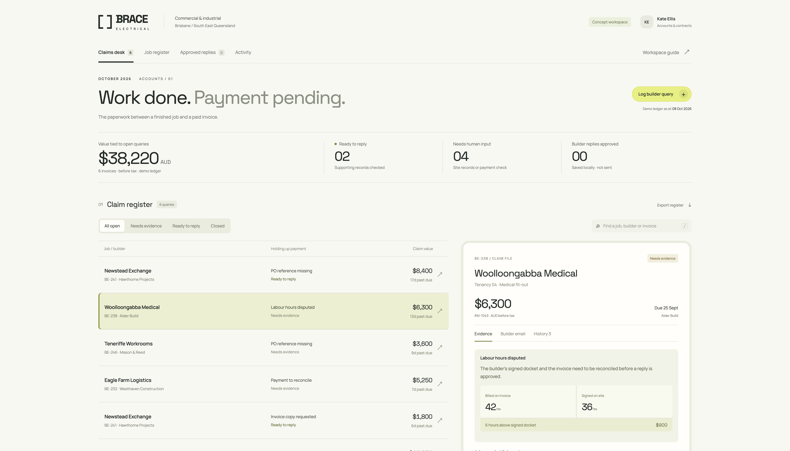

# Brace Electrical

**A working claims desk for a fictional Brisbane electrical subcontractor.**

A builder queries an invoice. Accounts needs to locate the purchase order, compare the signed labour docket, or ask the project manager for variation approval. Brace brings the job records, discrepancy and next action into one review screen.

A forward deployed engineering portfolio project: domain research, a business-specific UI, a persistent workflow, guarded automation and a reproducible local demo.



## Try it locally — about two minutes

**Requires Python 3.10+ only.** No npm install, database server, account, API key or paid service is needed. Fonts and assets are included locally.

```sh
git clone https://github.com/TanmaySomani/Brace-Electrical.git
cd Brace-Electrical
python3 run.py
```

On Windows, use `py -3 run.py` instead of `python3 run.py`.

Your browser opens at **http://127.0.0.1:8765**. Six synthetic builder queries are seeded automatically. Stop with **Ctrl+C**.

- Port occupied? `python3 run.py --port 8766`
- Fresh demo without changing saved work? `python3 run.py --fresh-demo`
- Open the browser manually? `python3 run.py --no-browser`

If you downloaded a ZIP, extract it and open a terminal in the folder containing `run.py`. Run the same command. Local decisions persist in `.local/brace.sqlite3`, which Git ignores.

## Recruiter walkthrough — five minutes

| Try this                                         | What to look for                                                                                                      |
| ------------------------------------------------ | --------------------------------------------------------------------------------------------------------------------- |
| **Woolloongabba Medical / INV-1043**             | The invoice bills 42 hours; the signed docket approves 36. A six-hour / AUD 900 difference blocks reply approval.     |
| Open **LD-238-17** in Job records                | The source viewer carries the job, builder and invoice associated with the evidence.                                  |
| Add a note, then **Refer to project manager**    | A local task and audit entry persist. No notification is sent.                                                        |
| **Newstead Exchange / INV-1042**                 | A matching PO is available. Review the draft and choose **Approve reply**.                                            |
| **Approved replies**                             | The exact approved text is saved. Download an `.eml` draft; the app does not send it.                                 |
| **Paddington Retail / INV-1047**                 | A site instruction and signed docket exist, but variation price approval is missing. The decision stays with a human. |
| **Eagle Farm Logistics / INV-1045**              | A customer's claim of payment does not mark the ledger paid.                                                          |
| **Job register**, search and **Export register** | Navigate by site and export a CSV of the case register.                                                               |

To try intake, click **Log builder query**:

```text
Builder email: accounts@hawthorne.example
Subject: Newstead / INV-1042 / purchase order
Message: Please send the purchase order for the Level 02 lighting rough-in.
```

Then try an unmatched sender. The pipeline withholds customer evidence when it cannot make a unique match. Pasted email addresses are demo inputs, not authenticated identities.

## Why this business?

ASBFEO discusses subcontractor payment delays involving variations, and QBCC's monies-owed process requests invoices, agreements and correspondence. These findings informed a job-first interface and explicit evidence review.

- [Research, sources and design decisions](DESIGN-RESEARCH.md)
- [Architecture, API and tradeoffs](docs/ARCHITECTURE.md)
- [Evaluation plan and production gaps](docs/EVALUATION.md)

Brace Electrical, its people, builders and projects are fictional. Research is desk research, not customer validation. Amounts are before tax; the demo ledger is dated **8 October 2026**. The app does not determine legal entitlement or calculate statutory deadlines.

## What is automated?

```text
Builder email
    ↓
Persist + deduplicate event
    ↓
Match sender and invoice within the demo ledger
    ↓
Classify query (offline rules / optional OpenAI)
    ↓
Retrieve invoice-scoped records + check arithmetic
    ↓
Human review
    ├── complete records → edit draft → approve → local outbox
    └── missing / conflicting records → refer with a note
    ↓
Audit history + manual query closure
```

The default **offline demo** uses rules for classification. It does not pretend to be a live LLM. Replies are assembled from scoped records and reviewed by a person. A model is optional because matching, arithmetic, access scope and approval should remain deterministic.

## Optional OpenAI mode

Set `OPENAI_API_KEY` and `OPENAI_MODEL` in your terminal environment, then run:

```sh
python3 run.py --ai
```

Choose an available model supporting Chat Completions JSON output. `--ai` explicitly enables provider calls and their associated cost; a configured key alone does not enable them. Only the email subject and body are sent to OpenAI. Returned classifications are checked against six allowed categories. Provider failures create a retryable error state; nothing is sent to a builder.

Existing cases retain their classification. Log a new query to try the model, or use `--ai --fresh-demo` to process all six demo queries with it. Keep credentials in your environment or secret manager, never in Git. `.env` files are not loaded automatically.

Live API calls are **not verified by the offline tests**. Reviewers do not need AI mode to test the workflow.

## Tests

```sh
python3 -m unittest discover -s tests -v
```

The suite covers matching, missing evidence, variations, payment claims, duplicate intake, concurrent/stale approvals, preserved state, HTTP protections and launcher options. Tests use temporary databases and make no provider calls.

GitHub Actions is configured for Linux, macOS and Windows with Python 3.10 and 3.13, plus a JavaScript syntax check. These CI targets are not a claim that every platform was tested locally.

## Implementation and boundaries

- Python standard library + SQLite; semantic HTML, vanilla JavaScript and responsive CSS.
- Locally hosted Manrope and Space Grotesk fonts. No runtime package dependencies.
- Loopback-only, one local reviewer, synthetic records. No telemetry or external requests in default demo mode.
- No live accounting, mailbox, PDF upload, external mail, team authentication or background scheduler is connected.
- Escalations are local tasks. Closing a query does not mark the invoice paid.

This is a tested local prototype, not an internet-facing production service. Font licenses are in `static/fonts/`. The source is shared for review; no blanket open-source license has been assigned.

## Ask the job file

Each claim now has an **Ask the file** tab. It can explain discrepancies, identify missing evidence and prepare project-manager handovers with source links.

The default mode shows a clearly labelled deterministic briefing. To enable custom OpenAI answers, configure `OPENAI_API_KEY` and `OPENAI_MODEL` in your terminal environment, then run:

```bash
python run.py --ai
```

Use a model available to your API project that supports Chat Completions, Responses and structured outputs. Credentials are read from environment variables, not from a browser form or an automatically loaded .env file. Keep keys out of Git and chat. API calls are billable; a fresh AI-mode database also classifies the six seed emails. Existing processed cases are preserved.

The assistant sends your question and the selected claim’s records to OpenAI. It has no action tools. Citations open source snapshots; check them before using an answer. Provider failures show an explicit error. Offline operation remains available without a key.

- [System design document](docs/SYSTEM-DESIGN.md)
- [Interactive Archify workflow](docs/diagrams/claim-workflow.html) — download and open in a browser, or use **Workspace guide → Explore the interactive workflow** while running locally.
- [Diagram delivery receipt](docs/diagrams/delivery-receipt.json)

AI integration tests mock provider responses. Live model quality has not been verified without locally configured credentials.
